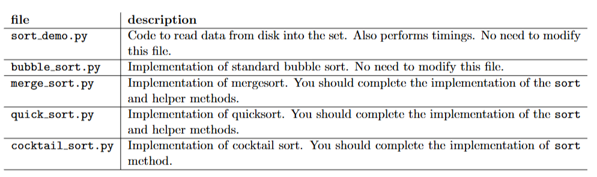
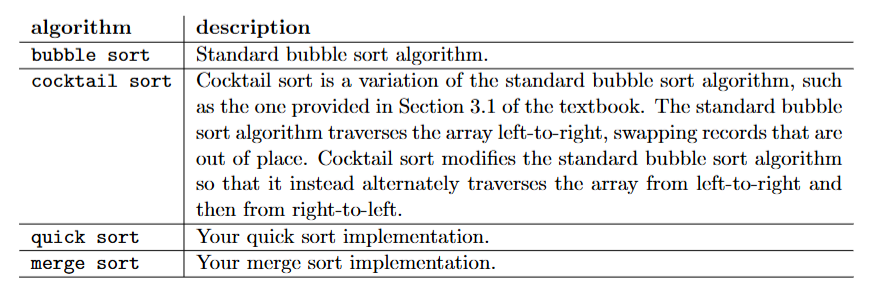
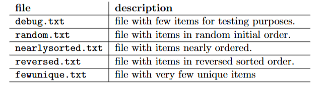

# Divide-and-conquer-sorting
Week 7: Divide and Conquer (Algorithms and Analysis, Sem1 2025)

## divide-and-conquer-mergesort-quicksort

Contains the skeleton code to implement divide and conquer solutions for merge sort and quick sort.

## Learning Objectives

Students who complete this lab should learn to implement three fundamental sorting algorithms (mergesort, quicksort and cocktail sort).

## Information about the code

```sort_demo.py``` reads a sequence of white-space separated integers from file and sorts them into ascending
numerical order. ```sort demo.py``` allows you to sort the input using several different sorting algorithms.
Most of the algorithms were covered in the lecture and in the text book.



Run the command using the following parameters:

```
python -Xss5m sort_demo.py <sort method> <input file>
```

Available sort methods are: 
- bubble;
- quick;
- merge; and
- cocktail

For example, ```python -Xss5m sort_demo.py quick random.txt``` runs quick sort on the random.txt text file. The parameter ```-Xss5m``` allocates 5mb of memory for the stack (for recursive functions).
For large files, you may need to allocate more memory.

The ```sort_demo.py``` program supports the following algorithms:



# Task

Your task in this lab exercise is to implement the following sorting algorithms:
- Merge sort is to be implemented in sort merge(). Mergesort is described in more detail in the lecture 5 slides 7 to 28 and Section 5.1 in the textbook.
- Quick sort is to be implemented in sort quick(). Quicksort is described in more detail in the lecture 5 slides 29 to 63 and Section 5.2 in the textbook.
- Cocktail sort is to be implemented in sort cocktail(). [See here for details](http://en.wikipedia.org/wiki/Cocktail_sort).

After implementing the three algorithms run each of the algorithms on the following test files and compare the run times:



Once you implemented and tested all your algorithms on the given test files try implementing the
following optimizations and rerun each algorithm on the test files:

### Quick sort pivot element selection
Selecting a good pivot can improve the speed of the algorithm
for certain data sets. Use the median-of-three strategy to choose the pivot element (see slide 63 in
the lecture notes and page 180 of book).

### Merge sort skip merge step
Merging two subarrays that do not overlap is trivial, i.e., if the largest
element of first subarray (last element in subarray) is less than the smallest element in the second
subarray (first element in subarray), then the two subarrays do not overlap. Implement this strategy
for nearly ordered lists/arrays.

### Cocktail sort skip already sorted elements
The first rightward pass will shift the largest element
to its correct place at the end, and the following leftward pass will shift the smallest element to its
correct place at the beginning. The second complete pass will shift the second largest and second
smallest elements to their correct places, and so on. After i passes, the first i and the last i elements
in the list are in their correct positions, and do not need to be checked. By shortening the part of
the list that is sorted each time, the number of operations can be halved.

**Did any of the algorithms improve significantly? If yes why do you think that is?**

## Challenges

- How do your experimental results compare to the known theoretical efficiencies of the algorithms?
- Describe the performance of cocktail sort as compared to bubble sort.

